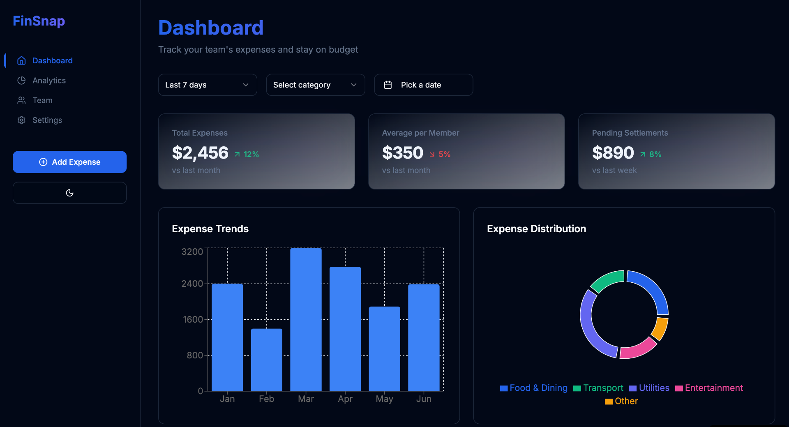

<div align="center">
  <h1>FinSnap</h1>
  <p>A modern expense tracking and management application for teams</p>
</div>



## 🚀 Features

- **Real-time Expense Tracking**: Monitor your team's expenses as they happen
- **Interactive Dashboard**: Visualize spending patterns with elegant charts and graphs
- **Team Management**: Collaborate with team members and track shared expenses
- **Smart Analytics**: Get insights into spending habits and trends
- **Budget Management**: Set and track budgets across different categories
- **Expense Categories**: Organize expenses by categories like Food & Dining, Transport, Utilities, and Entertainment
- **Dark Mode Support**: Elegant dark theme for comfortable viewing

## 💻 Tech Stack

This project is built with modern technologies:

- **React** - Frontend framework
- **TypeScript** - Type safety and better developer experience
- **Tailwind CSS** - Utility-first CSS framework
- **shadcn/ui** - High-quality UI components
- **Recharts** - Modern charting library
- **React Query** - Data fetching and state management
- **Vite** - Next generation frontend tooling

## 🛠️ Getting Started

1. **Clone the repository**
```bash
git clone <repository-url>
cd finsnap
```

2. **Install dependencies**
```bash
npm install
```

3. **Start the development server**
```bash
npm run dev
```

4. **Build for production**
```bash
npm run build
```

## 📱 Key Components

- **Dashboard Overview**: Track total expenses, average per member, and pending settlements
- **Expense Trends**: Visualize spending patterns over time with interactive charts
- **Expense Distribution**: See category-wise expense breakdown with an intuitive donut chart
- **Team Management**: Manage team members and their expense permissions
- **Settings**: Customize application settings and preferences

## 🎨 Design Philosophy

FinSnap features a modern, clean interface with a focus on usability and elegance. The dark theme provides excellent contrast and reduces eye strain during extended use. The UI components are carefully crafted to provide a seamless user experience while maintaining high functionality.

## 🤝 Contributing

Contributions are welcome! Please feel free to submit a Pull Request.

## 📄 License

This project is licensed under the MIT License - see the LICENSE file for details.

## 🌟 Acknowledgments

- Thanks to all contributors who have helped shape FinSnap
- Special thanks to the creators of the open-source libraries used in this project

---

<div align="center">
  <p>Built with ❤️ using <a href="https://lovable.dev">Lovable</a></p>
</div>